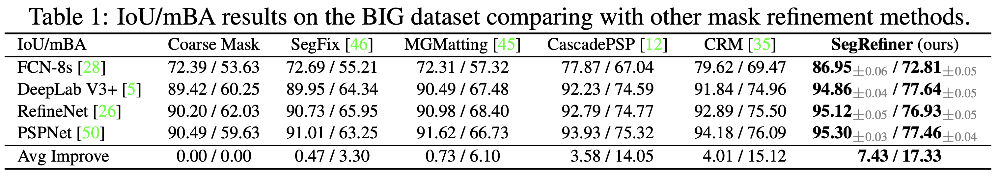
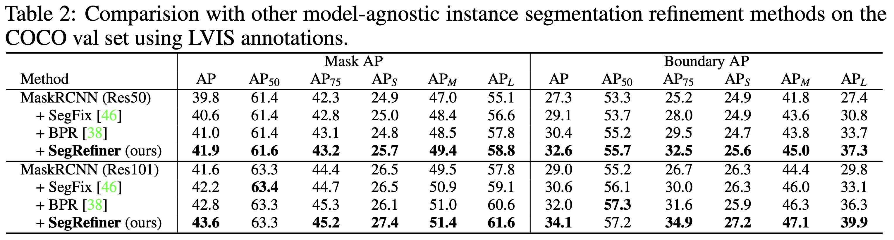
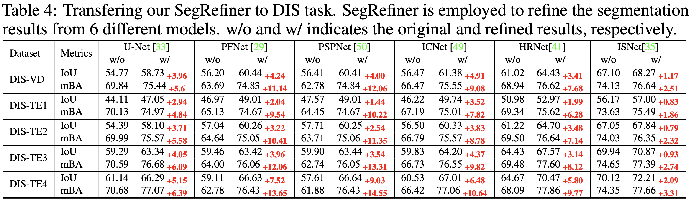

# SegRefiner

This is the official pytorch implementation of [SegRefiner](https://arxiv.org/abs/2312.12425) built on the open-source MMDetection.

> **SegRefiner: Towards Model-Agnostic Segmentation Refinement with Discrete Diffusion Process**   
> Mengyu Wang, Henghui Ding, Jun Hao Liew, Jiajun Liu, Yao Zhao, Yunchao Wei   
> NeurIPS, 2023  

## Highlights

- **SegRefiner:** A universally applicable refinement methodology designed to augment the segmentation accuracy across diverse segmentation tasks and models.
- **Novelty:** Regarding segmentation refinement as a denoising procedure and executing it via a discrete diffusion model.
- **Efficacy:** Consistently enhancing the accuracy across various segmentation tasks and models, with the capability to capture exceedingly fine details.


   

## Installation

```bash
conda create -n segrefiner python=3.8
conda activate segrefiner

# torch
pip install torch==1.12.1+cu113 torchvision==0.13.1+cu113 torchaudio==0.12.1 --extra-index-url https://download.pytorch.org/whl/cu113

# mmcv and mmdet
pip install openmim
mim install "mmcv-full==1.7.1"
pip install -e .

# for boundary AP evaluation
git clone -b lvis_challenge_2021 https://github.com/lvis-dataset/lvis-api.git
cd lvis-api
pip install -e .
```

## Dataset Preparation

Please download the [COCO dataset](https://cocodataset.org/#download),  [LVIS annotations](https://www.lvisdataset.org/dataset), [ThinObject-5K dataset](https://github.com/liewjunhao/thin-object-selection), [BIG dataset](https://github.com/hkchengrex/CascadePSP/blob/master/docs/dataset.md) and [DIS-5K dataset](https://github.com/xuebinqin/DIS) first and place them in the "**data**" directory. The structure of the "**data**" folder should be as follows:

```
data
├── big
│   ├── test
│   └── val
├── dis
│   ├── DIS-TE1
│   ├── DIS-TE2
│   ├── DIS-TE3
│   ├── DIS-TE4
│   ├── DIS-TR
│   └── DIS-VD
├── thin_object
│   ├── images
│   ├── list
│   └── masks
├── coco
│   ├── train2017
│   ├── val2017
│   └── annotations
|       ├── instances_train2017.json
│       └── instances_val2017.json
└── lvis
    └── annotations
        ├── lvis_v1_train.json
        └── lvis_v1_val.json
```

## Training

### LR-SegRefiner

The LR-SegRefiner is trained on the LVIS dataset, with the coarse masks employed in training generated in an **online** manner. Consequently, the training process can be initiated as follows:

```bash
# on one GPU
python tools/train.py configs/segrefiner/segrefiner_lr.py
# or on multiple GPUs
bash tools/dist_train.sh configs/segrefiner/segrefiner_lr.py 8
```

### HR-SegRefiner

The HR-SegRefiner is trained on a high-resolution dataset comprising ThinObject-5K and DIS-5K. Given the potential time consumption associated with online coarse masks generation in such high-resolution datasets, the coarse masks used in training are produced **offline** by executing:

```bash
python scripts/gen_coarse_masks_hr.py
```

The produced coarse masks will be saved in the `data/dis/DIS-TR` and `data/thin_object` direction. Subsequently, training can be initiated by executing:

```bash
# on one GPU
python tools/train.py configs/segrefiner/segrefiner_hr.py
# or on multiple GPUs
bash tools/dist_train.sh configs/segrefiner/segrefiner_hr.py 8
```

## Evaluation

The trained models are provided in [**LR-SegRefiner**](https://drive.google.com/file/d/1FrhbdwNyTlQYNbF9IgFF2tY3iQXHFcau/view?usp=sharing) and [**HR-SegRefiner**](https://drive.google.com/file/d/143kerk4WOerGZMqR-cAETb7rOcoQ0CQ_/view?usp=sharing).

For the inference phase, it is necessary to initially prepare the results produced by previous segmentation models as input for our SegRefiner. We provide the the [instance segmentation results](https://drive.google.com/file/d/12s4qhy3VwIbY1XNRT3ZqitQxNrqt3hM0/view?usp=sharing) we used in our experiments, most of which are produced by the MMDetection implementations. The input of BIG dataset and DIS-5K dataset can be accessed through [BIG](https://hkustconnect-my.sharepoint.com/:f:/g/personal/jchungaa_connect_ust_hk/Em8xxjDNRVNFpZaWwJV49NkBXxQwXd_AAIahQniAnq5IkQ?e=OwheVV) and [DIS-5K](https://drive.google.com/file/d/1PoI4R-thDYhAjqOaCwyXqvAaZFEJxWnT/view).

### COCO

To assess SegRefiner on the COCO dataset, initiate the evaluation process by executing the provided test script. This will generate refined results and save them in a JSON file.

```bash
# on one GPU
python tools/test.py configs/segrefiner/segrefiner_coco.py checkpoints/segrefiner_lr_latest.pth --out_prefix test_model_name
# or on multiple GPUs
bash tools/dist_test.sh configs/segrefiner/segrefiner_coco.py checkpoints/segrefiner_lr_latest.pth 8 --out_prefix test_model_name
```

Subsequently, execute the following evaluation script to obtain the metrics.

```bash
python scripts/eval_json.py
```

### BIG and DIS-5K

To assess SegRefiner on the BIG or DIS-5k datasets, begin by executing the following test script to obtain refined results, saving them in a folder in `.png` format.

```bash
# on one GPU
python tools/test.py \
configs/segrefiner/segrefiner_big.py \ # for BIG dataset
configs/segrefiner/segrefiner_dis.py \ # for DIS-5K dataset
checkpoints/segrefiner_hr_latest.pth --out_dir test_model_name
# or on multiple GPUs
bash tools/dist_test.sh \
configs/segrefiner/segrefiner_big.py \ # for BIG dataset
configs/segrefiner/segrefiner_dis.py \ # for DIS-5K dataset
checkpoints/segrefiner_hr_latest.pth 8 --out_dir test_model_name
```

Following that, run the provided evaluation scripts to acquire the corresponding metrics.

```bash
# for BIG dataset
python scripts/eval_miou.py
# for DIS-5K dataset
python scripts/eval_miou_dis.py
```


## Results on BIG dataset

   


## Results on COCO val-set (with LVIS annotation)

   


## Results on DIS5K dataset

  


## BibTeX
Please consider to cite SegRefiner if it helps your research.

```bibtex
@inproceedings{SegRefiner,
  title={{SegRefiner}: Towards Model-Agnostic Segmentation Refinement with Discrete Diffusion Process},
  author={Wang, Mengyu and Ding, Henghui and Liew, Jun Hao and Liu, Jiajun and Zhao, Yao and Wei, Yunchao},
  booktitle={NeurIPS},
  year={2023}
}
```
