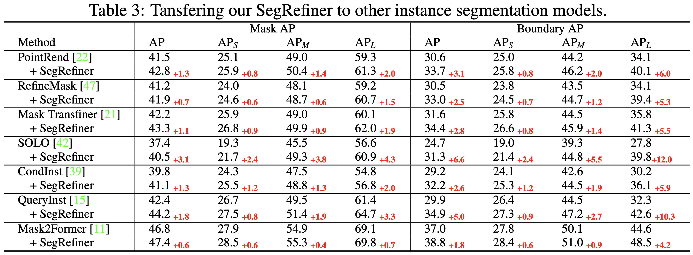

# SegRefiner

> **SegRefiner: Towards Model-Agnostic Segmentation Refinement with Discrete Diffusion Process**   
> Mengyu Wang, Henghui Ding, Jun Hao Liew, Jiajun Liu, Yao Zhao, Yunchao Wei   
> NeurIPS, 2023  

We will release our code soon!   

## Visualization of how SegRefiner performs inference

   

## Results on BIG dataset

   

## Results on COCO val-set (with LVIS annotation)

   

## Results on DIS5K dataset

  
